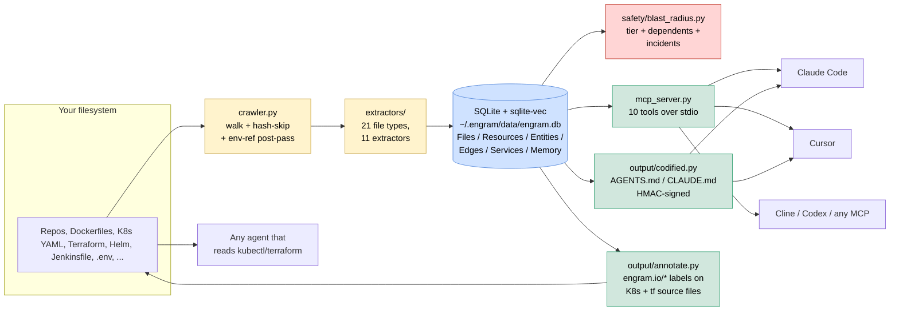

# Engram architecture

Engram is intentionally small: ~3,200 lines of Python organised around one
SQLite database with three output channels.

## Components

### Crawler — `engram/crawler.py`
Walks configured paths, runs the right extractor per file, content-hashes
each file for skip-on-re-run, and does a post-pass to link `env_var` defs to
`env_ref` consumers across files. Skips dotdirs and binary files by default.

### Extractors — `engram/extractors/`
Eleven concrete extractors covering 21 file types. Each emits three kinds
of output:

- **Resources** — structural units of infrastructure (k8s:Deployment,
  tf:aws_db_instance, docker:image, helm:chart, jenkins:stage, …).
- **Entities** — code-level units (function, class, env_var, env_ref,
  package, port, …).
- **Edges** — typed relationships (DEPENDS_ON, USES, MOUNTS, USES_ENV,
  BELONGS_TO, …).

All deterministic. No LLM in the extraction path. Python uses the stdlib
`ast`; JS/TS uses tree-sitter (with a regex fallback); Terraform uses a
hand-rolled HCL parser; YAML uses PyYAML with first-class K8s detection;
the rest are line-based.

### Storage — `engram/db.py`, `engram/schema.sql`
One SQLite file at `~/.engram/data/engram.db`. WAL mode so CLI and MCP
server can read concurrently. `sqlite-vec` is loaded for the optional
vector tables (`vec_file_chunks`, `vec_memory`). FTS5 powers lexical
search — which works well for DevOps content (env var names, image refs,
hostnames) where embeddings often add noise.

### Safety — `engram/safety/blast_radius.py`
The killer primitive. Given `(operation, target)`:
1. Classify the operation (`destructive` / `mutating` / `read` / `unknown`)
   by verb extraction.
2. Resolve the target → cross-format resource set.
3. Infer environment (`production` / `staging` / `dev`) from resource
   labels, namespace, or path segments.
4. Walk 1-hop in-edges to find dependents.
5. Query the memory table for matching incidents / runbooks.
6. Combine into a tier (`green` / `orange` / `red`) and a recommended
   action (`proceed` / `confirm` / `block`).

This is the function `engram assess` and the MCP `blast_radius` tool both
call. Always read-only; never executes anything.

### Three output channels

**Channel A — MCP server (`engram/mcp_server.py`).** Ten stdio tools:
`blast_radius`, `infra_context`, `trace_env_var`, `dependents_of`,
`infra_diff`, `service_map`, `verify_context`, `remember`, `recall`,
`forget`. Implementations live in `engram/mcp_tools/` and `engram/safety/`
so they can be unit-tested without booting the MCP server.

**Channel B — Codified context (`engram/output/codified.py`).** Writes a
generator-managed markdown section into `AGENTS.md` / `CLAUDE.md` /
`INFRA.md`. The section is HMAC-signed; any human content outside the
markers is preserved byte-for-byte. `engram check-drift` detects when the
on-disk section no longer matches the current graph. Works *without* MCP —
useful for air-gapped or locked-down environments where you can't install
an MCP server.

**Channel C — Infrastructure annotation (`engram/output/annotate.py`).**
Writes `engram.io/*` labels into K8s manifest `metadata.labels` and
`engram.io/*` tags into Terraform `tags = { … }` blocks. Idempotent.
Every applied annotation is logged to the `annotation` table for safe
rollback via `engram unlabel`. A Terraform allowlist (`output/tf_taggable.py`)
prevents tagging resources that don't support tags — which would otherwise
break `terraform plan`.

## Why three channels?

Different deployment contexts have different constraints:

| Context | MCP works? | Markdown works? | Labels work? |
|---|---|---|---|
| Claude Code / Cursor power user | ✅ best |   ✅ fine     | ✅ optional |
| MDM-locked corporate laptop | ❌ install blocked | ✅ |   ✅       |
| Air-gapped / FedRAMP / ITAR | ❌ no fetch | ✅ |   ✅       |
| Agent that has never heard of Engram | ❌ | ❌ |   ✅       |

Channel C in particular is the asymmetric leverage: once labels exist in
the source, *any* agent calling `kubectl describe pod` or `terraform show`
sees Engram's context inline, no installation required on the agent side.

## Schema highlights

The 12-table SQLite schema is in `engram/schema.sql`. The two design
choices that matter most:

1. **`risk_tier` is a first-class column** on both `file` and `resource`,
   not a derived view. The blast-radius primitive has to be cheap to
   call (per-tool-call hot-path); we don't recompute tiers at query time.

2. **`edge` is a single typed table** rather than a separate table per
   relationship. The `rel_type` column discriminates. This keeps the
   schema small and lets future relationship types land without
   migrations.

Every common column has an explicit index. No reliance on the optimizer.

## What this isn't

- Not a code-search tool. Use `code-graph-mcp` or `CodeGraphContext`
  for source code analysis.
- Not a general-purpose memory layer. Use Mem0, Zep, or Letta.
- Not an action server. Use Terraform-MCP, Kubernetes-MCP, or
  Azure-DevOps-MCP to *do* things. Engram tells those servers what
  they're about to touch.

Engram is the **context and safety gate** between the agent and the
action layer.
